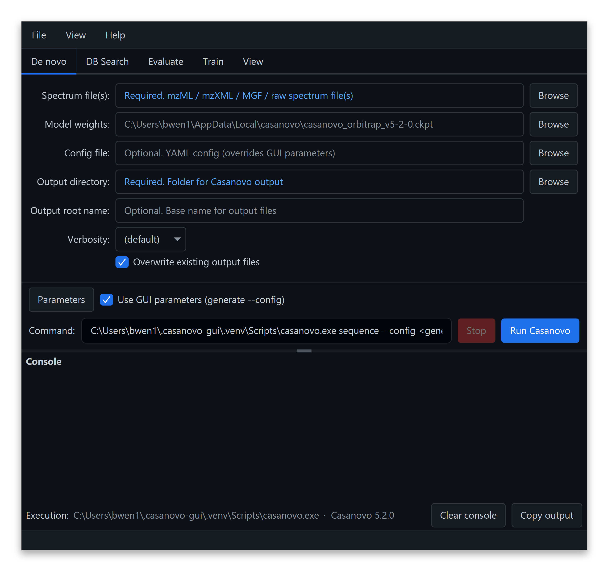

# CasanovoGUI

 

CasanovoGUI is a cross-platform desktop application for
[Casanovo](https://github.com/Noble-Lab/casanovo) — *de novo* peptide sequencing
from MS/MS spectra with a transformer model. Configure your inputs and parameters
in a simple form, click **Run Casanovo**, and watch the output stream live in the
console. The GUI wraps Casanovo's command-line sub-commands — *de novo* sequencing,
database search, evaluation, and training — each as its own tab, plus a **View** tab
to explore your results: map peptides to a reference proteome, inspect score
distributions and per-residue confidence, and open spectra in
[PDV](https://github.com/wenbostar/PDV) for annotated-spectrum visualization.

## Installation

Download the installer for your platform from the
[**Releases page**](https://github.com/Noble-Lab/CasanovoGUI/releases/latest):

| OS | Download | How to run |
|----|----------|------------|
| **Windows** | `CasanovoGUI-<version>-windows-x64.zip` | Unzip and run `CasanovoGUI.exe` |
| **macOS** (Apple Silicon) | `CasanovoGUI-<version>-macos-arm64.dmg` | Open and drag to Applications |
| **Linux** | `CasanovoGUI-<version>-linux-x86_64.deb` or `…-linux-x86_64.tar.gz` | Install the `.deb`, or just extract the `.tar.gz` (no root) and run |

**No manual tool installation is needed.** The installers bundle their own Java
runtime, so you do **not** have to install Java. And the first time you start an
analysis, if Casanovo isn't already on your machine the GUI offers to **install it
for you** — it downloads a private Python and Casanovo automatically (no Python or
`pip` setup required). Just download, launch, and run.

> **Intel Macs:** use the cross-platform `CasanovoGUI-<version>.jar` from the
> Releases page instead (it needs a Java 23+ runtime installed).

## Documentation

For a complete guide to using CasanovoGUI — installing it, running each task
(*de novo* sequencing, database search, evaluation, and training), and exploring
your results in the **View** tab — see
**[Getting Started: Graphical User Interface](https://casanovo.readthedocs.io/en/latest/getting_started_gui.html)**
in the [Casanovo documentation](https://casanovo.readthedocs.io/en/latest/).
